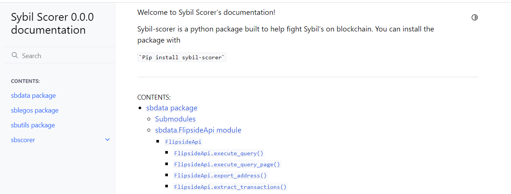

# sybil-scorer

Sybil scorer is a python package that provides useful classes and methods to analyze the behavior of addresses.

## Installation

- Python 3.10
- ```pip install sybil-scorer```

## What is inside?

The package has two main sub-packages.

- **sbdata** is a package to easily retrieve a large amount of data from the flipside API.
- **sblegos** a package to perform on-chain transactions analysis to detect potential Sybil behavior.
- **sbutils** is a package that makes it easy to load the data extracted with sbdata and use it in sblegos.

More details on the packages and examples are provided below.

### sbdata

An example script to retrieve data from the flipside API is provided in the script folder:
script/demo_extract_eth_txs_oss.py

It could also be used to retrieve transactional data from an address with some simple calls:

``` python
import os
from sbdata.FlipsideApi import FlipsideApi

api_key = os.environ['FLIPSIDE_API_KEY']
flipside_api = FlipsideApi(api_key, max_address=1000)
address = ['0x06cd8288dc001024ce0a1cf39caaedc0e2db9c82']
tx_add_eth = flipside_api.get_transactions(address, chain='ethereum')
```

It walks you through the process of retrieving data from the flipside API and saving it in a folder.

To use this package you will need an API key from flipside that you can get
here: https://sdk.flipsidecrypto.xyz/shroomdk/apikeys

### sblegos and sbutils

sblegos provides the following analysis of legos:

- **has_same_seed** : true if the address has the same seed as any other address in the grants contributors
- **has_same_seed_naive** : true if the address has the same seed as any other address in the grants contributors with a
  naive approach: address of the from_address of the first transaction.
- **has_suspicious_seed_behavior** : true if has_same_seed is different from has_same_seed_naive. It means the user
  performed some actions before funding his wallet.
- **has_interacted_with_other_contributor** : true if the user has interacted with any other contributor to the grant
- **has_less_than_n_transactions** : true if the user has less than n transactions.
- **has_transaction_similitude** : true if the user has a transaction history that is similar to any other contributor
  to the grant.
- **has_transaction_similitude_opti** : an optimized version of has_transaction_similitude, when used across multiple
  addresses.

A jupyter notebook using both packages is available as a jupyter notebook
here https://github.com/poupou-web3/grant-exploration/blob/main/gr-climate-exploration.ipynb

The following snippet of code will check if any address has the same seed as any other contributor to the climate grant

``` python
import os
import sys
from pathlib import Path
import numpy as np
import pandas as pd
from legos import TransactionAnalyser
from utils import LoadData

current_dir = Path(os.getcwd())

# Load the addresses we want to study here all contributors to the climate grant
path_to_grants = "data/grants"
path_to_contributor_address = os.path.join(path_to_grants, "address")
full_path_add = os.path.join(current_dir, path_to_contributor_address)
df_address = pd.read_csv(os.path.join(full_path_add, "df_contribution_address_CLIMATE.csv"))
list_address = df_address["address"].tolist()

# Load the transactions of the addresses
path_to_parent = Path(current_dir).parent
path_to_tx = os.path.join(path_to_parent, 'transactions_full')
data_loader = LoadData.LoadData(path_to_tx)

# Load the transactions of the addresses in a dataframe
df_tx = data_loader.create_df_tx('ethereum', list_address)

# Initialise the TransactionAnalyser class
tx_analyser = TransactionAnalyser.TransactionAnalyser(df_tx, df_address=df_address)
df_matching_address = pd.DataFrame(df_tx.EOA.unique(), columns=["address"])

# Check if the address has the same seed as any address in the grant returns a df with a boolean column 'seed_same_naive'
df_matching_address['seed_same_naive'] = df_matching_address.loc[:, 'address'].apply(lambda x : tx_analyser.has_same_seed_naive(x))

```

## Documentation

The documentation of the package is available at https://sybil-scorer.readthedocs.io/en/latest/py-modindex.html.
For a local version of the documentation, you can build it using sphinx. with the following commands:

```
cd docs
sphinx-apidoc -o ./source ../sbscorer
make html
```

Then open the file docs/build/html/index.html in your browser.
The local version of the documentation is prettier than the one hosted on readthedocs.


## Additional Data

Some data for easier use of the package in the context of Gitcoin grants are made available on Ocean market.

### Ethereum Transaction Data

Ethereum Transaction data are available for download on Ocean here:
https://market.oceanprotocol.com/asset/did:op:826780ac16a444d65a0699e0e7629e67688c7b6a31ba2d1e672e3a2b398cab08

These are all the transactions performed by users who contributed to the grant as of 20th of January 2022.
It is organized with one CSV file for each address to facilitate the loading of only the necessary data transactions
when performing analysis on a specific grant or project.

The data was produced using the sbdata package and the FlipsideApi class.

### Standardised Grant Data and Addresses

The data provided by Gitcoin was standardized in the same format for all grants to make it easier to manipulate. For
example to find all the wallet addresses of contributors to a specific project or grant.

These can be recreated by using the files provided by ODC/Gitcoin. The files provided should be put with the
architecture below. Each Grant is in a folder and inside there are the applications CSV and the votes CSV.

Then run the jupyter notebook jupyter/normalize_contribution_data.ipynb
this will create files in the root of the -explo
folder as shown below.

You can also download the standardized data from Ocean market place here:

- Standardized grant
  contributions : https://market.oceanprotocol.com/asset/did:op:eac43d546ba84e5b82ddf4d2fbf4db9290711e8d2c2a167bce148b7209d41623
- standardized grant
  applications : https://market.oceanprotocol.com/asset/did:op:1d319077f7879e48b01aad52e4a69fc0ea06594c908575df4bd5cd015338b8cf

```commandline
data/grants
│   df_application_normalized.csv
│   df_contribution_address_CLIMATE.csv
│   df_contribution_address_ETHEREUM.csv
│   df_contribution_address_FANTOM.csv
│   df_contribution_address_GR15.csv
│   df_contribution_address_OSS.csv
│   df_contribution_address_UNICEF.csv
│   df_contribution_normalized.csv
│   df_new_grant_contributor_address.csv
│   df_new_round_address.csv
│   unique_ctbt_address.csv
│
├───Climate
│       climate_grant_applications.csv
│       climate_grant_votes.csv
│
├───Ethereum
│       ethereum_grant_applications.csv
│       ethereum_grant_votes.csv
│
├───Fantom
│       fantom_grant_applications.csv
│       fantom_grant_votes.csv
│
├───GR15
│       GR15_contributions.csv
│       GR15_grants_applications.json
│
├───oss
│       oss_grant_applications.csv
│       oss_grant_votes.csv
│
└───UNICEF
        unicef_grant_applications.csv
        unicef_grant_votes.csv
```

## Future works

Future works include:

- Adding more transactional analysis lego.
- Adding temporal features to a clustering algorithm as researched in the first
  hackathon [submission](https://github.com/poupou-web3/GC-ODS-Sybil).
- Adding legos using tags and labels of flipsidde API for example to filter similar seed wallet addresses.
